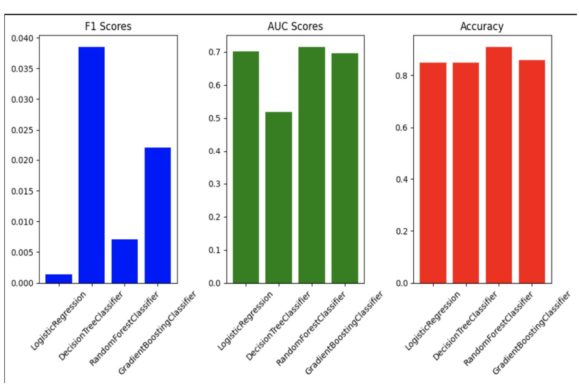

# Healthcare Fraud Detection

Detecting fraudulent activities in healthcare systems using big data and machine
learning.

## Overview

Healthcare fraud contributes significantly to rising healthcare costs, affecting
patients, insurers, and governments. This project leverages big data analytics
and machine learning to identify fraudulent practices like drug prescription
abuse, questionable billings, and fraud hotspots across the U.S.

### Key Highlights:

- **Datasets:** Medicare Part-D Prescribers, Payments to Physicians, Excluded
  Individuals/Entities Database.
- **Tech Stack:** PySpark for big data processing, MLlib for machine learning
  models.
- **Goal:** Build a robust system to prevent fraud and enhance fiscal integrity
  in healthcare.

## Methodology

1. **Data Preprocessing:**

   - Labeled Part-D dataset using LEIE to identify fraud.
   - Merged datasets on unique identifiers (e.g., NPI).
   - Transformed features for compatibility with ML models.

2. **Big Data Processing:**

   - Used PySpark for querying and transforming large datasets.

3. **Machine Learning:**

   - Models tested: Logistic Regression, Random Forest, Decision Trees, and
     Gaussian Naive Bayes.
   - Metrics: Accuracy, F1 Score, AUC.

## Results

  
